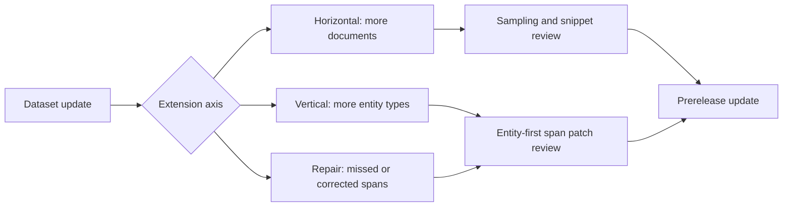
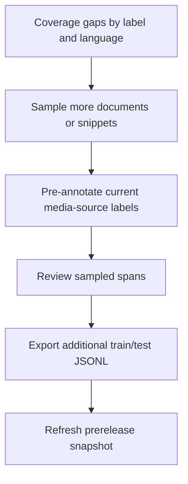
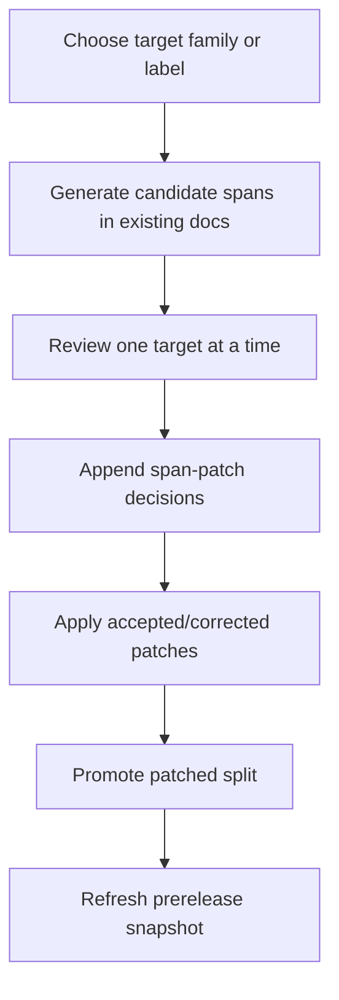
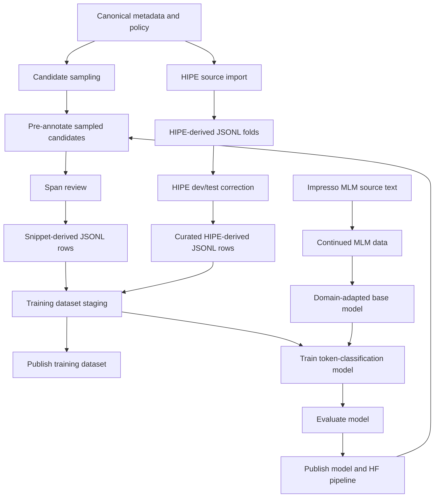
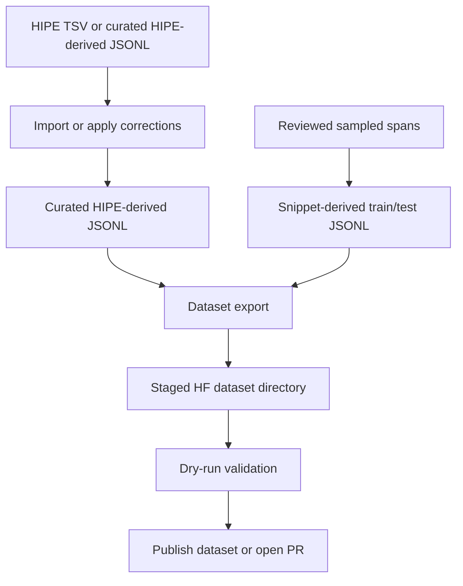
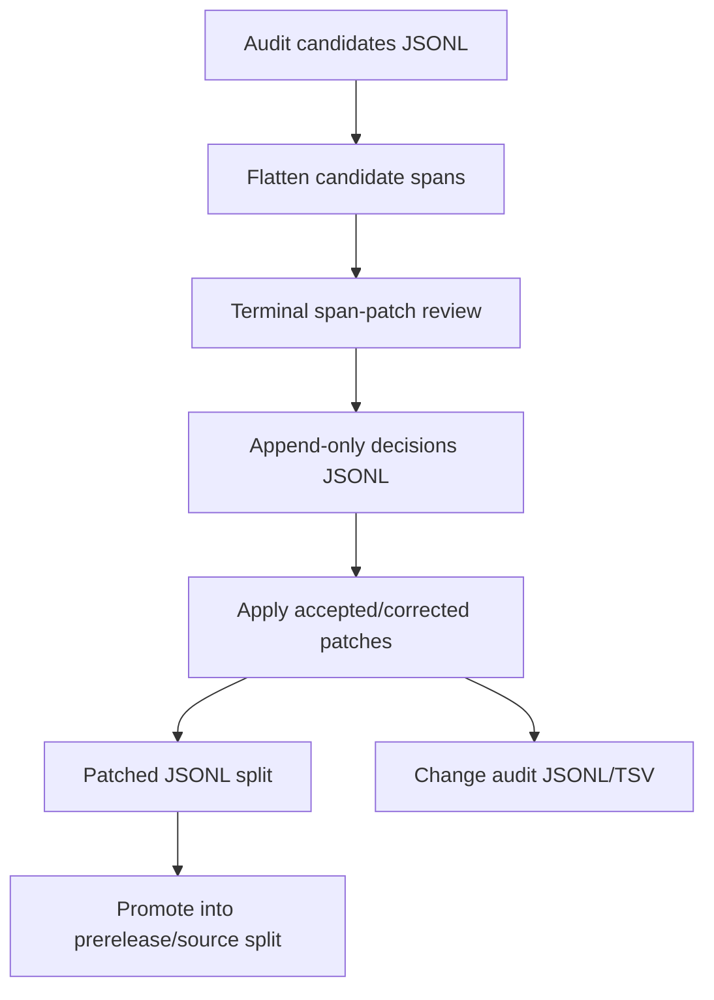
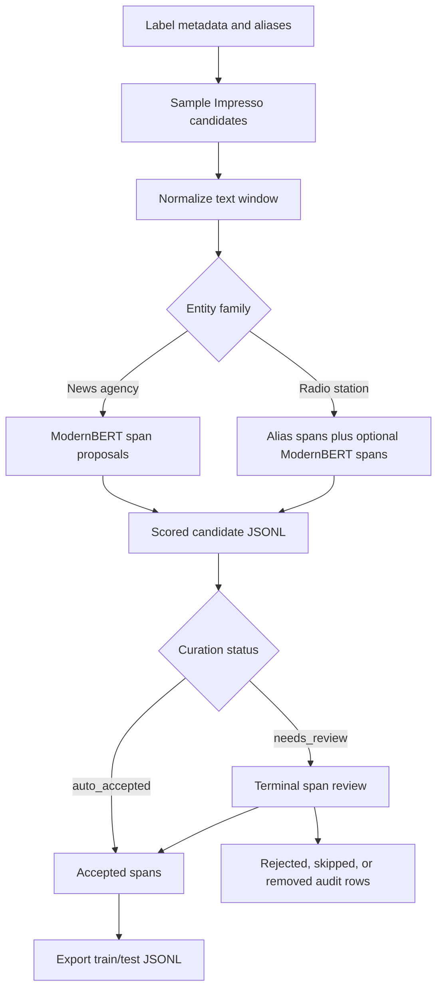
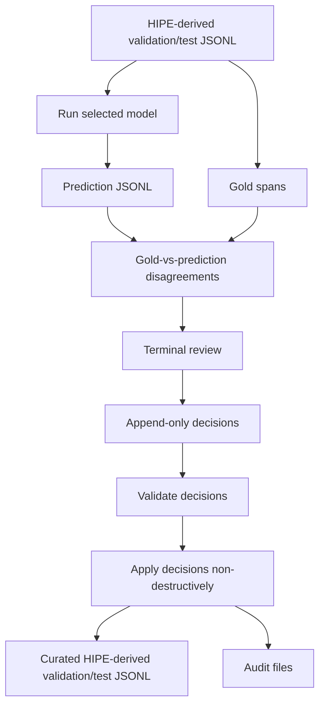
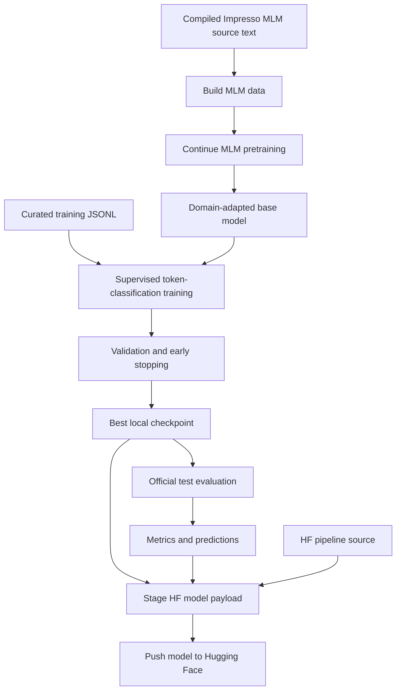
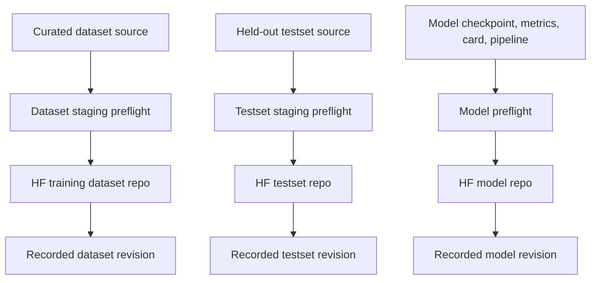

# Workbench Workflows

This document gives a compact view of the main workbench activities. The workbench is the control plane: it creates and curates local JSONL artifacts, trains/evaluates models, and stages published Hugging Face dataset and model repositories.

In diagrams and prose, **HIPE-derived data** means the converted French/German news-agency annotations imported from the earlier HIPE/CoNLL-style source files. This data is still an active baseline training and evaluation source. Some local paths and commands keep the historical `legacy-*` name for compatibility.

## Dataset Extension Axes

The workbench separates dataset growth into two axes:

- **Horizontal extension** adds more documents/examples for existing labels.
- **Vertical extension** adds more entity types or deeper annotations inside existing documents.

This distinction is important for planning, review, metrics, and release notes. See `DATASET_EXTENSION_PLAN.md`.



### Horizontal Extension



### Vertical Extension



For future newspaper mentions, prefer target-scoped passes such as `org.ent.newspaper.nzz` first, then the next newspaper label. This keeps reviewer decisions consistent.

## Overall Activities



## Create Or Update Datasets



Primary commands:

```bash
make import-legacy-hipe ARGS="..."
make apply-curation CFG=configs/model-v2.0.0.mk
make export-newsagency-snippets CFG=configs/model-v2.0.0.mk
make export-radiostation-snippets CFG=configs/model-v2.0.0.mk
make publish-dataset CFG=configs/model-v2.0.0.mk ARGS="--dry-run"
```

## Audit-Driven Span Patches

Use audit-driven span patches when suspicious missing annotations are found in existing documents, or when adding a new entity family inside existing documents.



Primary commands:

```bash
make audit-empty-training-docs CFG=configs/model-v2.0.0.mk
make review-span-patches CFG=configs/model-v2.0.0.mk REVIEWER="$USER"
make apply-span-patches CFG=configs/model-v2.0.0.mk
make span-patch-status CFG=configs/model-v2.0.0.mk
make promote-span-patches CFG=configs/model-v2.0.0.mk
```

Use `make refresh-span-patches CFG=configs/model-v2.0.0.mk` when you want to apply accepted decisions and immediately promote the patched split into the configured prerelease/source split.

For target-scoped vertical extension, override `SPAN_PATCH_AUDIT_ID`, `SPAN_PATCH_CANDIDATES`, `SPAN_PATCH_SOURCE_JSONL`, and `SPAN_PATCH_TARGET_LABEL`.

## Create, Pre-Annotate, And Review Sampled Data



Primary commands:

```bash
make sample-newsagencies CFG=configs/model-v2.0.0.mk
make score-newsagency-snippets CFG=configs/model-v2.0.0.mk
make review-newsagency-snippets CFG=configs/model-v2.0.0.mk REVIEWER="$USER"
make export-newsagency-snippets CFG=configs/model-v2.0.0.mk

make sample-radiostations CFG=configs/model-v2.0.0.mk
make score-radiostation-snippets CFG=configs/model-v2.0.0.mk
make review-radiostation-spans CFG=configs/model-v2.0.0.mk REVIEWER="$USER"
make export-radiostation-snippets CFG=configs/model-v2.0.0.mk
```

## Correct HIPE-Derived Dev/Test Data



Primary commands:

```bash
make curate-legacy-eval CFG=configs/model-v2.0.0.mk CURATION_MODEL=models.d/newsagency_radiostation_modernbert_v2.0.0_continue1/best
make review-curation CFG=configs/model-v2.0.0.mk REVIEWER="$USER"
make validate-curation CFG=configs/model-v2.0.0.mk
make apply-curation CFG=configs/model-v2.0.0.mk
```

## Create Or Update Models



Primary commands:

```bash
make download-mlm-sources CFG=configs/model-v2.0.0.mk
make build-mlm-data CFG=configs/model-v2.0.0.mk
make pretrain-mlm CFG=configs/model-v2.0.0.mk
make push-mlm-model CFG=configs/model-v2.0.0.mk
make train CFG=configs/model-v2.0.0.mk
make test CFG=configs/model-v2.0.0.mk
make test-official CFG=configs/model-v2.0.0.mk
make push-model CFG=configs/model-v2.0.0.mk
```

## Publish Artifacts



Primary commands:

```bash
make publish-dataset CFG=configs/model-v2.0.0.mk ARGS="--dry-run"
make publish-testset CFG=configs/model-v2.0.0.mk ARGS="--dry-run"
make push-model CFG=configs/model-v2.0.0.mk
```
